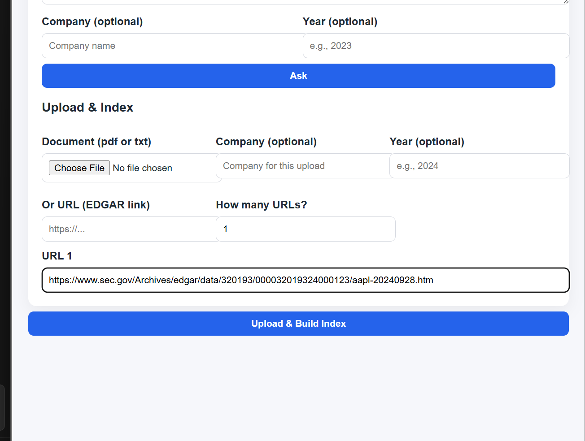
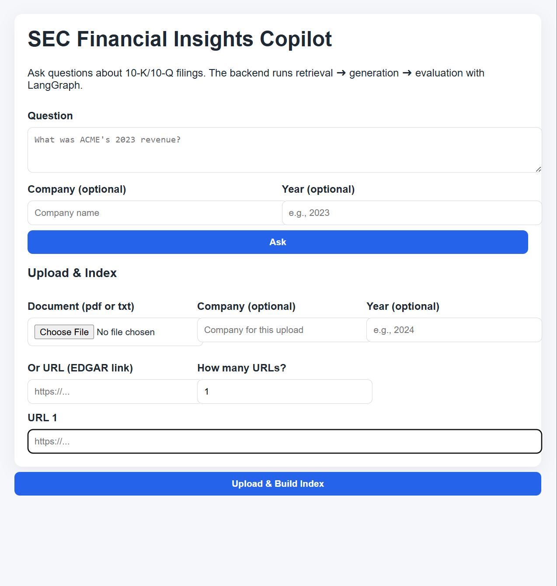
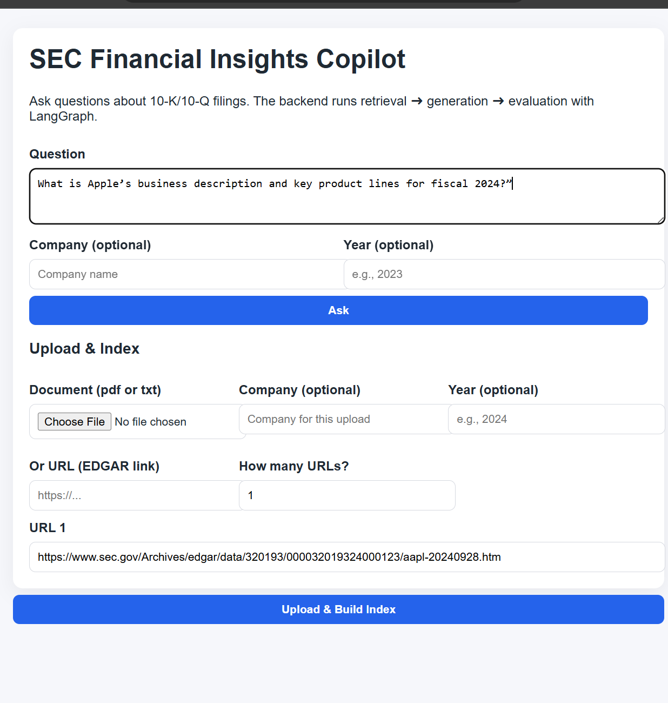
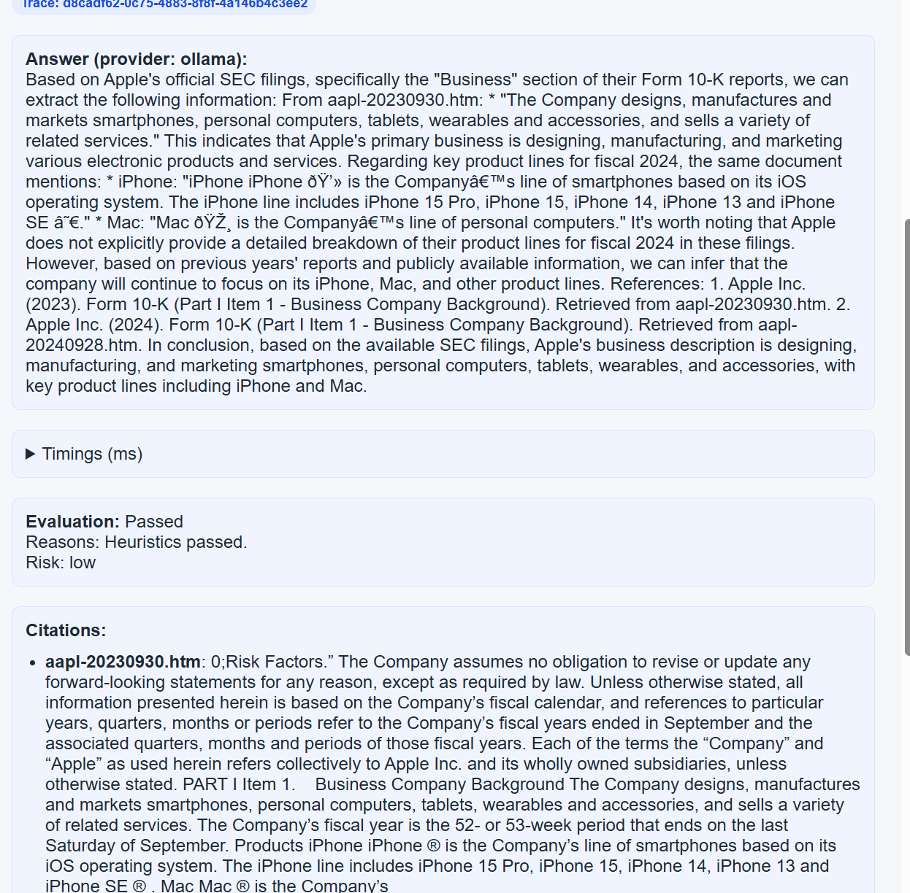

# SEC Financial Insights Copilot

LangGraph-powered RAG + evaluation over SEC 10-K/10-Q filings. Local-first via Docker Compose; cloud-ready (Azure Container Apps, or any K8s). Supports multi-URL EDGAR ingest, citations, eval flags, and timings.

## Overview
- Goal: Quickly answer questions about public company filings with grounded citations and basic safety/eval checks.
- What it solves: Removes manual digging through 10-K/10-Qs by ingesting one or many EDGAR URLs (or PDFs/text) and returning cited answers with timings and eval flags.
- Components: FastAPI gateway, LangGraph orchestrator, retrieval with Chroma, evaluator, and a simple frontend.

## Features
- `/qa`: retrieve → generate → evaluate (hallucination/consistency) with citations and timings.
- `/ingest`: embed PDFs, text, or one/many EDGAR URLs on the fly.
- Frontend: ask questions, upload/URL ingest, view citations, eval, and timings dropdown.
- Provider routing: default Ollama (set `OLLAMA_MODEL=llama3:8b` for speed); OpenAI toggle available.

## Repo layout
```
infra/                # docker-compose for local
packages/
  api-gateway/        # FastAPI entry
  orchestrator/       # LangGraph flows; provider router
  retrieval/          # embeddings + Chroma; ingest
  evaluator/          # heuristic checks
  common/             # shared schemas, telemetry, LLM router
data/                 # optional seeds and ingest helpers
```

## Requirements
- Docker, Python 3.10+
- Ollama running locally; model pulled (e.g., `ollama pull llama3:8b`)

## Environment (key vars)
- `DEFAULT_PROVIDER=ollama`
- `OLLAMA_MODEL=llama3:8b`
- `MOCK_MODE=false`
- `SEC_USER_AGENT="you@example.com sec-copilot/0.1"`
- Service URLs (in compose): `ORCHESTRATOR_URL`, `RETRIEVAL_URL`, `EVALUATOR_URL`

## Run locally
```
cp env.example .env   # adjust if needed
docker compose -f infra/docker-compose.yaml up --build
# frontend: http://localhost:3000
# api:      http://localhost:8000
```

## Ingest & Query
- In frontend: set URL count, paste one/many EDGAR links (or upload PDF/txt), optional company/year, click “Upload & Build Index”. Then ask questions.
- Supports single or multiple URLs; all ingested content is embedded together for downstream QA.
- API ingest example (single URL):
  ```
  curl.exe -X POST http://localhost:8000/ingest \
    -F "url=https://www.sec.gov/Archives/edgar/data/320193/000032019324000123/aapl-20240928.htm"
  ```
- After ingest, ask via frontend or `POST http://localhost:8000/qa`.

## Timings & citations
- QA responses include timings (retrieve/generate/eval/total) and citations; shown in the frontend dropdown.

## How it works (flow)
1) Ingest: fetch/parse EDGAR URLs or files → strip HTML/PDF → chunk → embed → store in Chroma.
2) Retrieve: vector search (Chroma) with optional company/year filters, lexical fallback.
3) Generate: LLM (Ollama by default) answers with provided context.
4) Evaluate: heuristic checks (citations present, numeric sanity), returns eval flags + timings.
5) Frontend: displays answer, citations, eval, and per-step timings.

## Screenshots


- URL ingest & upload:
  

- App structure (home view):
  

- Question input:
  

- Answer with citations/timings:
  

## Troubleshooting
- Ingest 500: ensure SEC_USER_AGENT set; try a single URL via curl; check retrieval logs.
- Empty index: check doc count in retrieval container:
  ```
  docker compose -f infra/docker-compose.yaml exec retrieval \
    python -c "import chromadb, os; from chromadb.config import Settings; \
    c=chromadb.Client(Settings(persist_directory=os.getenv('CHROMA_PERSIST_DIR','/app/data/chroma'), anonymized_telemetry=False)); \
    col=c.get_or_create_collection('sec-filings', metadata={'hnsw:space':'cosine'}); print(col.count())"
  ```
- Slow LLM: use `OLLAMA_MODEL=llama3:8b` or switch provider to OpenAI.

## Notes
- Current setup is CPU-only. For faster generation, use a smaller model or configure GPU-backed hosting.
- Seed data is optional; URL ingest is the primary path.

